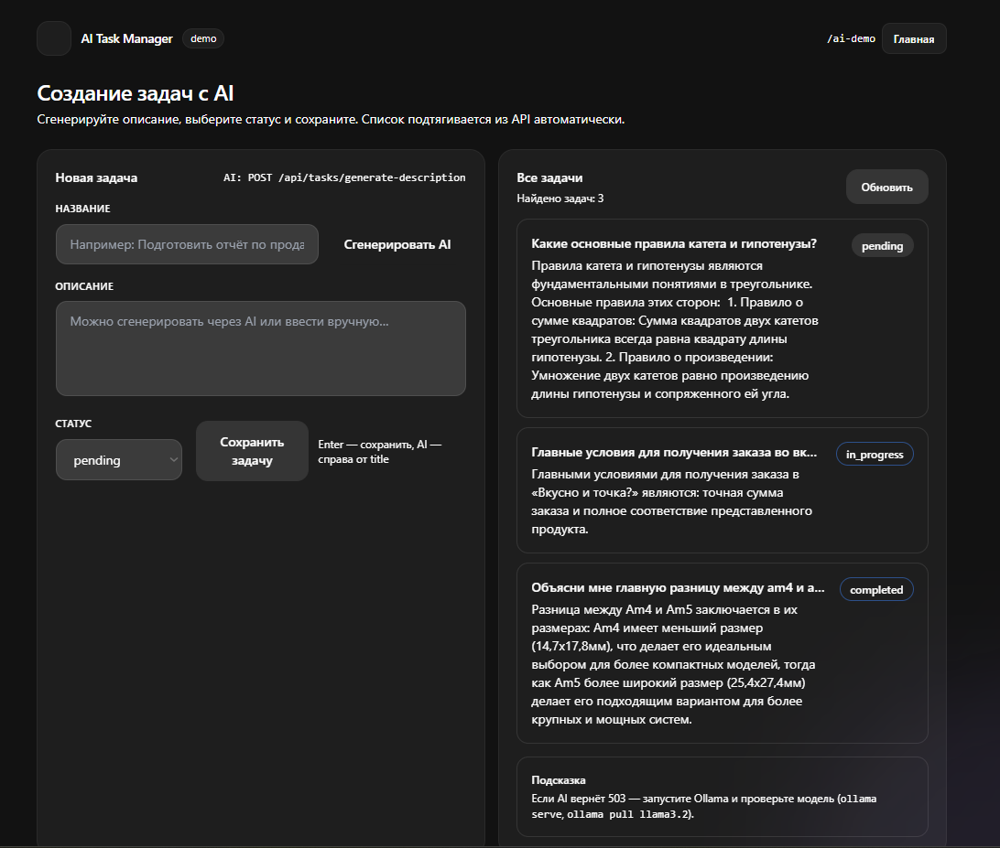

# AI Task Manager

Мини-проект на Laravel: задачи (CRUD через API) + демо AI‑генерации описания задачи через локальный Ollama.

## Возможности

- **API задач**: `GET/POST/PATCH/DELETE /api/tasks`
- **AI‑генерация описания**: `POST /api/tasks/generate-description`
- **Демо‑страница**: `GET /ai-demo` (форма + список задач)

## Скриншот интерфейса



> Если картинка не отображается — добавьте файл `docs/ai-demo-ui.png` в репозиторий.

## Требования

- PHP (рекомендуется 8.2+)
- Composer
- Node.js + npm (если собираете фронт)
- Любая поддерживаемая Laravel БД (SQLite/MySQL/PostgreSQL)
- Ollama (для AI‑генерации)

## Установка Ollama

1. Установите Ollama с официального сайта: `https://ollama.com/`
2. Запустите сервис:

```bash
ollama serve
```

3. Скачайте модель (используется в контроллере по умолчанию):

```bash
ollama pull llama3.2
```

Проверка, что Ollama живой:

```bash
curl http://localhost:11434/api/tags
```

## Настройка проекта

Установите зависимости:

```bash
composer install
```

Если используете Vite/Tailwind через сборку:

```bash
npm install
npm run build
```

### Настройка `.env`

Создайте `.env` из примера:

```bash
cp .env.example .env
```

Сгенерируйте ключ приложения:

```bash
php artisan key:generate
```

Настройте подключение к БД в `.env` (например, SQLite):

```env
DB_CONNECTION=sqlite
```

Для SQLite обычно достаточно создать файл базы:

```bash
php -r "file_exists('database/database.sqlite') || touch('database/database.sqlite');"
```

## Запуск миграций

```bash
php artisan migrate
```

## Запуск приложения

```bash
php artisan serve
```

Откройте демо:

- `http://localhost:8000/ai-demo`

## Демо AI‑функции

### Через UI

1. Откройте `/ai-demo`
2. Введите **название задачи**
3. Нажмите **“Сгенерировать AI”** — поле **description** заполнится через API
4. Нажмите **“Сохранить задачу”** — отправится `POST /api/tasks`, список обновится

### Через API (пример)

Генерация описания:

```bash
curl -X POST "http://localhost:8000/api/tasks/generate-description" ^
  -H "Accept: application/json" ^
  -H "Content-Type: application/json" ^
  -d "{\"title\":\"Подготовить отчёт по продажам\"}"
```

Создание задачи:

```bash
curl -X POST "http://localhost:8000/api/tasks" ^
  -H "Accept: application/json" ^
  -H "Content-Type: application/json" ^
  -d "{\"title\":\"Подготовить отчёт по продажам\",\"description\":\"...\",\"status\":\"pending\"}"
```

Получение списка:

```bash
curl -X GET "http://localhost:8000/api/tasks" -H "Accept: application/json"
```

## Примечания

- AI‑эндпоинт использует Ollama на `http://localhost:11434`.
- Если получаете **503** от AI‑эндпоинта — проверьте, что Ollama запущен и модель скачана.

<p align="center"><a href="https://laravel.com" target="_blank"></a></p>

<p align="center">
<a href="https://github.com/laravel/framework/actions"></a>
<a href="https://packagist.org/packages/laravel/framework"></a>
<a href="https://packagist.org/packages/laravel/framework"></a>
<a href="https://packagist.org/packages/laravel/framework"></a>
</p>

## About Laravel

Laravel is a web application framework with expressive, elegant syntax. We believe development must be an enjoyable and creative experience to be truly fulfilling. Laravel takes the pain out of development by easing common tasks used in many web projects, such as:

- [Simple, fast routing engine](https://laravel.com/docs/routing).
- [Powerful dependency injection container](https://laravel.com/docs/container).
- Multiple back-ends for [session](https://laravel.com/docs/session) and [cache](https://laravel.com/docs/cache) storage.
- Expressive, intuitive [database ORM](https://laravel.com/docs/eloquent).
- Database agnostic [schema migrations](https://laravel.com/docs/migrations).
- [Robust background job processing](https://laravel.com/docs/queues).
- [Real-time event broadcasting](https://laravel.com/docs/broadcasting).

Laravel is accessible, powerful, and provides tools required for large, robust applications.

## Learning Laravel

Laravel has the most extensive and thorough [documentation](https://laravel.com/docs) and video tutorial library of all modern web application frameworks, making it a breeze to get started with the framework.

In addition, [Laracasts](https://laracasts.com) contains thousands of video tutorials on a range of topics including Laravel, modern PHP, unit testing, and JavaScript. Boost your skills by digging into our comprehensive video library.

You can also watch bite-sized lessons with real-world projects on [Laravel Learn](https://laravel.com/learn), where you will be guided through building a Laravel application from scratch while learning PHP fundamentals.

## Agentic Development

Laravel's predictable structure and conventions make it ideal for AI coding agents like Claude Code, Cursor, and GitHub Copilot. Install [Laravel Boost](https://laravel.com/docs/ai) to supercharge your AI workflow:

```bash
composer require laravel/boost --dev

php artisan boost:install
```

Boost provides your agent 15+ tools and skills that help agents build Laravel applications while following best practices.

## Contributing

Thank you for considering contributing to the Laravel framework! The contribution guide can be found in the [Laravel documentation](https://laravel.com/docs/contributions).

## Code of Conduct

In order to ensure that the Laravel community is welcoming to all, please review and abide by the [Code of Conduct](https://laravel.com/docs/contributions#code-of-conduct).

## Security Vulnerabilities

If you discover a security vulnerability within Laravel, please send an e-mail to Taylor Otwell via [taylor@laravel.com](mailto:taylor@laravel.com). All security vulnerabilities will be promptly addressed.

## License

The Laravel framework is open-sourced software licensed under the [MIT license](https://opensource.org/licenses/MIT).
